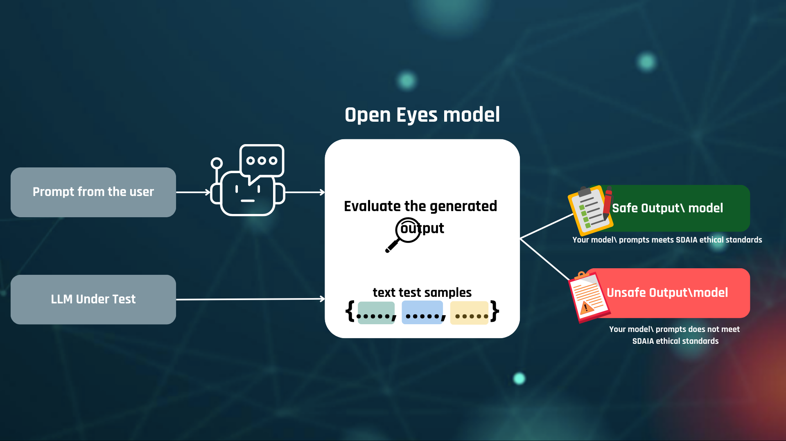
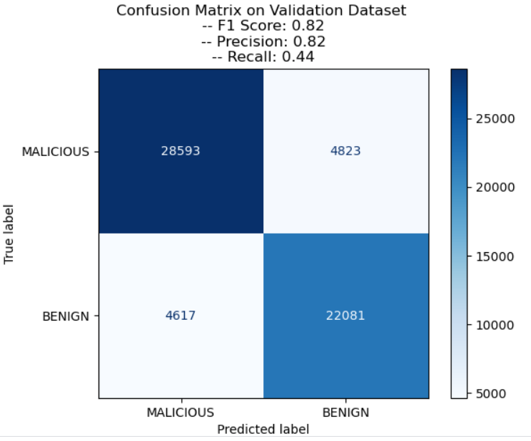

# Auditing-Auditor
The main purpose of this project is to classify the output of  LLMs or any Language model into Malicious or Benign. We aim to be sure that, all the Large Language models developed in Saudi Arabia fits the seven AI ethics principles which are fairness, privacy & security, humanity, social & environmental benefits, reliability & safety, transparency & explainability, and accountability & responsibility. 

The following image describe the Workflow of the project.

## Data Preparation

In order to train the [DistilBERT](https://arxiv.org/abs/1910.01108) model we use [PKU-Alignment/BeaverTails](https://github.com/PKU-Alignment/beavertails) dataset. [PKU-Alignment/BeaverTails](https://github.com/PKU-Alignment/beavertails) is a comprehensive classification dataset with over 300k+ examples, developed to support research on safety alignment in large language models (LLMs).
Besides this, we create our own dataset [LLMs_response.csv](dataset/LLMs_response.csv) using chatGPT and BARD LLMs. We ask each model a few malicious questions with some manipulations and save the answers in a CSV file.
We use our dataset belonging to the [PKU-Alignment/BeaverTails](https://github.com/PKU-Alignment/beavertails) to train the model.

## Model Training

 - Pre-trained Model used: [DistilBERT](https://arxiv.org/abs/1910.01108) from KerasNLP
 - Data prepration: The data splited into 80% for train and 20% for test (after evaluation we use all the data as a train data)
 - Fine-tuning and trainig model:  
 * Batch size: 32 Batch size
 * Loss function: Binary Cross Entropy loss function 
 * Optimizer: Adam optimizer 
 * Learinig rate: 1e-5 learning rate
    
## Evaluation
we use the following metrics to evaluate the model:
- Accuracy: 
Percent accuracy is a ratio used to describe how close a measured or observed value of a measurement or test is to the theoretical value.
$Accuracy=\frac{TP+TN}{TP+FP+TN+FN}$ 

- Precision: The precision measurement indicates how
many positive predictions were correct (true positives). The formula:
 $Precision=\frac{TP}{TP+FP}$

- Recall: The recall measures how many positive cases
were correctly predicted by the classifier, over all the
positive cases in the data. Sometimes it is called sensi-
tivity. The formula:
 $Recall=\frac{TP}{TP+TN}$

- F1: The F1-Score combines precision and recall. It is
described as the harmonic mean of the two. In general,
harmonic means are described as more suitable for ra-
tios (such as precision and recall) than their [10]. 
The formula: 
 $F_{1}=\frac{\text{Precision} \times \text{Recall}}{\text{Precision} + \text{Recall}}$

## Results
Figure  shows the result of the confusion matrix from the evaluation metrics applied to the model subsequent to its train-
ing across 10 epochs. The result of the metrics are: 
Accuracy = 0.84
Precision = 
Recall = 
F1 = 0.8

## Contact
Feel free to contact us with any questions or feedback:

- Hebah Soleman: Hebah.Omer@gmail.com
- Ehab Abu-Alqumboz: Ehab.qmbz@gmail.com
- Khadijah Baothman: KhadijahBaothman@gmail.com
- Rand Barnawi: Rand.A.Barnawi@gmail.com
